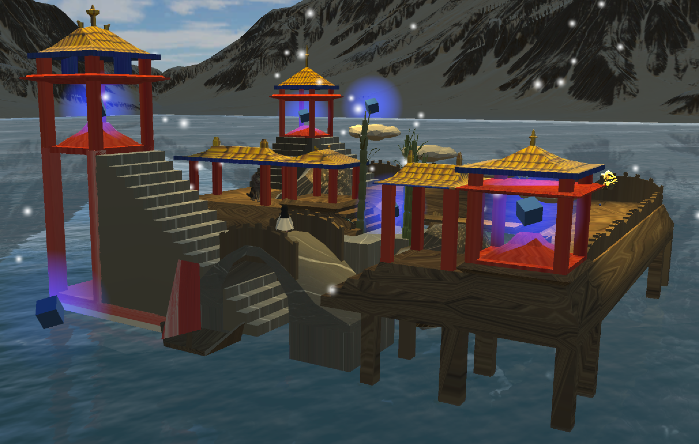

# Team Glitch - Annica's World

#### Team Members:
Yuxin Zheng | yzheng347@gatech.edu | yzheng347

Wenqi Xian | wxian3@gatech.edu | wxian3

Wenjie Yao | wenjie@gatech.edu | wyao48

Arsene Lakpa | alakpa3@gatech.edu | alakpa3

Danny Zhang | danny.zhang@gatech.edu | dzhang314

**Objective:** Annica’s world is an exploration puzzle game. The game is won by exploring the level and collecting all of the diamonds. You lose if you fall into the water or if you are caught by the wolf guardian.

**Scene to Open:** Assets/AppContent/Scenes/StartScene.unity and Assets/AppContent/Scenes/AlphaDemo.unity

**Scenes to Build:** Assets/AppContent/Scenes/StartScene.unity and Assets/AppContent/Scenes/AlphaDemo.unity

Github repo: https://github.com/wxian3/annica-game

**Character Controls:** (We recommend using a mouse)

Rotate camera:
Move the mouse to change both character and camera directions. The camera is fixed to always look at character's back. The distance between camera and character is also  fixed, and the player can zoom in/out by scrolling the mouse wheel. Camera rotation is 360 degree in Z-plane, and 6 to 82 degree looking down to Y-plane.

Jump:
Use "Right click" or "Space". There is a trigger range at the bottom of the character. When jumping, the character is set to “not grounded”. When the ground enters the trigger range, the character is set to “grounded”. Jumping is enabled only when the character is grounded. (If for some reason you are jumping for only 0.01 high, you may not able to jump again, because there not trigger range entering. But that rarely happens.)

Walk:
Use "left click" to move forward, also use "WASD" or directional keys("Up","Down","Left","Right") to move forward, backward, left, right. The character use the same math with camera in Y-plane.

Pause game:
Use "Esc", pause menu with restart and quit button shows up.

Parameters:
All parameters, such as, speed of character on ground, speed of character when jumping, sensitivity of camera rotation to mouse moving, allowed camera angle in Y-rotation were adjusted with feedback from playtesting.

**3D World with Physics and Spatial Simulation:**

3D Models:
3D models of the character and buildings are made by ourselves from scratch using Maya 3D modeling tool. We synthesized this unique environments and challenges for the game. Models of wolf, butterflies and Crying mask are obtained from external sources from Assets store.

Rigidbody:
Characters have rigidbody effects. In Crying Mask, tears and wood box has rigidbody simulation. Tears can drop down and hit character. Wood box can be pushed by character.

Physical Material:
Physical material is set to the character, so that she will not slip down from ramps.

Graphical:
All buildings and most objects and NPCs, as well as the character, have colliders on them. Thus, they never get into each other. With buildings, we mainly use mesh colliders. With others, we mainly use groups of cube or sphere colliders.

Audio Effect:
There is audio clips when character jumps, character collects diamonds, character dies and wolf. Also, audio effect when topography changes, such as, bridge rotating.

Speed adjustment:
When jumping, the moving speed is adjusted to half as on ground to make the jump more realistic.

**AI:**

NPC-Wolf:
The wolf is the enemy in this game. Annica will die if she gets too close to the wolf. The wolf is guarding an area of the map and patrol around its territory. When the character enters its guarding range, it will run to the character and howl to intimidate her. But after the character leaves its guarding range, it walks back to its starting position and sit there.

**Interaction with Environment:**

NPC-Butterfly:
Butterflies are friendly NPC who give the player hints about puzzles. They play a flying animation as default status. When the character is near a butterfly, it stops and tells the character a hint using canvas text.

Crying Mask:
Mask is crying. A butterfly is going to tell you that the tear is treasure so that you use the nearby wood box to collect tear. With enough tears, it becomes a diamond (treasure), and mask stops crying. Once a tear (blue ball) touches the ground, it disappears.
Tears come from a spawning point at the position of mask's left eye. The nearby ground is set to destroy tear gameobject when it touches them.
*Two background hints that you may or may not know: In Chinese fairytale, in southern part of the world, there are mermaids. When they cry, tears become pearls. And tear is called "water without root", which means it does not can from sky or river, and it should not touch the ground.

Disappearing Wood Block:
The wood block will disappear once the character touches it. It is a pitfall, because it looks like a shortcut toward the center platform.

Faded out Cloud:
When jump on cloud, it will fade out. So that character should move as quick as possible to jump from cloud to cloud. This is not easy and needs practice.

Rotatable Bridge and Drivable Boat:
After collecting certain diamond, the bridge will rotate and lead the character to a drivable boat. The boat can move in Z direction, so that character can drive it to approach remote diamond.

**Polish:**

Particle effect:
There is snow falling down.

Reflection of the water:
Water reflects like a mirror, so that you can see mountains in it.

**External Sources:**
Mountain Model
Water Model & Water reflection effect
Butterfly Model & animation
Wolf Model & animation
Cloud Model
Dialogue Canvas animation (with script)

**Who Did What:**

Yuxin Zheng: character control and animation, NPC/AI interaction

Wenqi Xian: management of the main scene, 3D models and animation of building and character, environment interaction (rotating bridge, drivable boat), audio.

Wenjie Yao: character & camera control, environment interaction(NPC-Butterfly, Crying Mask, disappearing wood block), physical simulation

Arsene Lakpa: UI Canvas Design, NPC Chat Box Design

Danny Zhang: implemented colliders onto the entire map, game environment/map design and implementation, cloud jumping minigame, Annica’s death logic, Canvas UI integration
